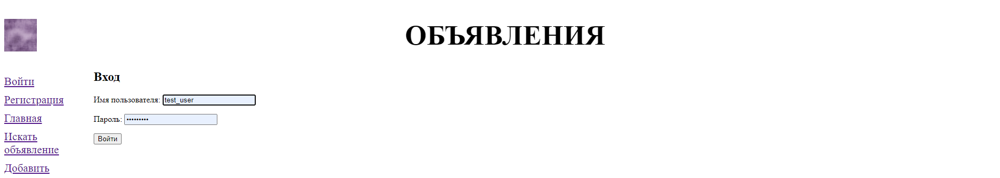

# Board_project
This is a bulletin board website where users can place their ads and look for some they need. There's also implemented basic authentication and authorization.
Users can delete/edit their ads (but not others) and search for ads related to a rubric, they are interested in. There is also an opportunity to leave comments below ads.
The following images represent some pages of the site:
      
# Technologies used
* [**Django Framework**](https://www.djangoproject.com/)
* [**SQLite**](https://www.sqlite.org/index.html)
* [**Pillow**](https://pillow.readthedocs.io/en/stable/)
* [**django-crispy-forms**](https://django-crispy-forms.readthedocs.io/en/latest/)
* [**django recaptcha**](https://pypi.org/project/django-recaptcha/)
# Features
* Added some data validation in [*models*](bboard/models.py), using standard validation methods and custom methods.
* Write a custom *RubricManager*, that has a method to order rubrics based on number of ads in them.
* Added *captcha* to the registration form, using [*django recaptcha*](https://pypi.org/project/django-recaptcha/).
# How to run
1. Go to command line and choose or make a directory, where you want this cloned project to be 
   (if you use Windows, you need to press Windows + R, type cmd, and hit Enter to open Command Prompt window, then type the path you want, I will place this project on my desktop):
   * *cd Desktop*
2. Now you need to make sure [**git**](https://git-scm.com/) is installed on your computer (type the following):
   * *git --version*
       * if your command prompt shows something like: *git version 2.29.2.windows.2*, go to the 3rd step.
       * otherwise, go [here](https://phoenixnap.com/kb/how-to-install-git-windows) and read how to install it properly.
3. So, it is time to clone the project:
   * *git clone https://github.com/Fagtoy/board_project.git*
     * Then you have to go in project directory, it's default name is *board_project*:
        * *cd board_project*
5. Now it is time to set up your virtual environment:
   * *pip install pipenv*
   * *pipenv shell* 
6. Final steps:
   * Install requirements: *pipenv install -r requirements.txt*
   * *python manage.py migrate*
   * *python manage.py runserver*
